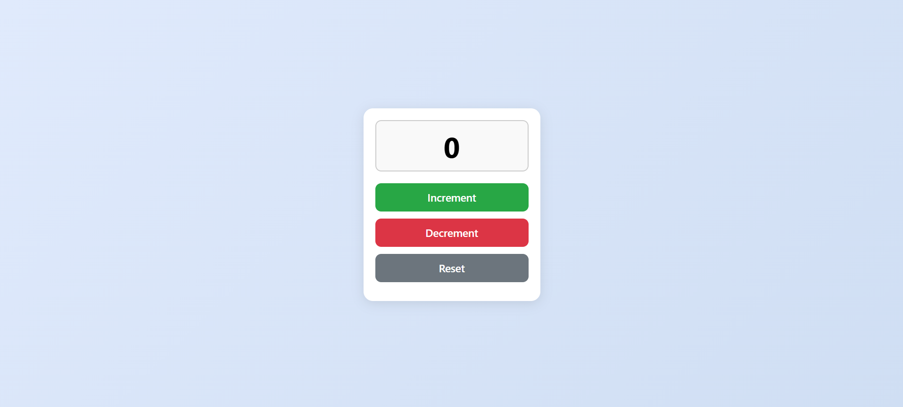

# Counter App

A simple JavaScript counter application that allows users to increment, decrement, and reset a numerical value.

## Features

- Increment and decrement the counter value
- Reset the counter to zero
- Responsive and user-friendly interface

## Technologies Used

- HTML
- CSS
- JavaScript

## Getting Started

1. Clone the repository:
    ```bash
    git clone https://github.com/SameerBaral/counter-app.git
    ```
2. Open `index.html` in your browser.

## Usage

- Click the "Increment" button to increase the count.
- Click the "Decrement" button to decrease the count.
- Click the "Reset" button to reset the count to zero.

## Screenshots




## Live Link
[Counter App]()